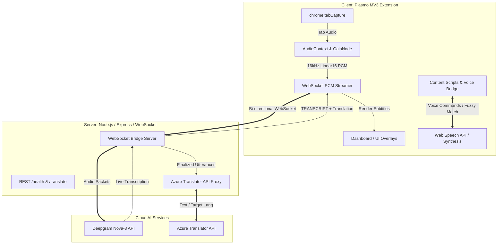

# 🌟 Sensa — Advanced Sensory & Accessibility Assistant

[](https://developer.chrome.com/docs/extensions/mv3/)
[](https://docs.plasmo.com/)
[](https://react.js.org/)
[](https://www.typescriptlang.org/)
[](https://tailwindcss.com/)
[](https://deepgram.com/)
[](https://azure.microsoft.com/en-us/products/cognitive-services/translator)

**Sensa** is an architectural-grade, dual-mode Google Chrome browser extension designed to empower deaf, hard-of-hearing, and visually impaired individuals. By bridging cutting-edge Web APIs (Speech Recognition, Speech Synthesis, Web Audio API, Tab Capture) with real-time cloud AI (Deepgram Nova-3 & Azure Translator), Sensa transforms standard web browsing into a fully responsive, tailored sensory experience.

---

## 🎯 Executive Summary & Mission

The modern web is primarily designed for unimpaired audio-visual consumption. Users with sensory disabilities frequently encounter barriers such as uncaptioned audio, lack of multilingual accessibility, cluttered visual layouts, and mouse-dependent navigation. 

**Sensa** solves these challenges through two dedicated, deeply integrated operational modes:
1. **🦻 Auditory Mode (for Deaf & Hard-of-Hearing Users):** Converts tab audio into low-latency, real-time multilingual subtitles with instant translation, visual sound spectrum animations, and environmental noise alerts.
2. **👁️ Visual Mode (for Visually Impaired Users):** Replaces visual-motor navigation with hands-free voice commands, intelligent text-to-speech (TTS) narration, screen magnification, and screen-dimming Focus Mode.

---

## ✨ Core Features & Capabilities

### 🦻 Auditory Mode
* **🎙️ Live Multilingual AI Captions (`useLiveCaptions.ts` & `api.ts`):**
  * Captures browser tab audio via `chrome.tabCapture` and resamples it to 16kHz PCM audio.
  * Streams binary audio packets over WebSockets to Sensa's Node.js backend, which bridges directly into **Deepgram Nova-3**.
  * Supports real-time transcription across **45+ languages** (including English, Spanish, Filipino, Hebrew, Arabic, Japanese, Korean, French, German, and more).
  * Implements a zero-gain `GainNode` audio routing architecture to prevent feedback loops while keeping audio audible to the user.
* **🌐 Instant AI Translation (`server.js`):**
  * Integrates **Azure Translator API** server-side to translate finalized speech utterances on-the-fly into the user's target language without exposing API keys to the browser client.
* **📊 60fps Audio Visualizer (`Visualizer.tsx`):**
  * Leverages Web Audio API (`AnalyserNode`) to generate responsive, high-framerate frequency bar animations that allow deaf users to "see" audio dynamics and pacing.
* **🚨 Sudden Noise & Loudness Alerts (`NoiseAlert.tsx`):**
  * Continuously monitors RMS audio volume and triggers visual radar badges and warning banners whenever sharp or loud environmental noises occur in browser tabs.
* **🎨 Customizable Subtitle Overlay (`TextSizeOverlay.tsx` & `CaptionTransparencyOverlay.tsx`):**
  * Features draggable styling modals allowing users to scale subtitle typography (12px to 72px) and adjust background opacity (25% to 100%).
  * Draggable viewport offset positioning ensures configuration panels never obscure active video players.
* **📜 Transcript History & Export (`TranscriptHistoryOverlay.tsx`):**
  * A slide-out sidebar that records chronological dialogue blocks (original source + translation) with smart bottom-lock autoscrolling and plain-text (`.txt`) archive downloads.

---

### 👁️ Visual Mode
* **🗣️ Hands-Free Voice Control (`visualModeVoiceBridge.ts` & `modeSelectionVoiceBridge.ts`):**
  * Injects Web Speech API (`SpeechRecognition`) listeners directly into host pages to enable zero-click navigation.
  * Users can activate or deactivate modes, switch to Auditory Mode, or adjust narration speeds simply by speaking commands (e.g., *"activate"*, *"deactivate"*, *"auditory mode"*, *"faster"*, *"slower"*).
  * Features a **3000ms confirmation window** during onboarding to prevent ambient room noise from triggering unintended mode selections.
* **🧠 Levenshtein Fuzzy Scoring Engine:**
  * Implements weighted Levenshtein distance algorithms and N-gram token matching to resolve vocal ambiguities and speech-to-text phonetic collisions (e.g., distinguishing between *"inter"* / *"center"* and *"enter"*).
* **📖 Smart Reader & TTS Narration (`useSpeech.ts` & `ReadingSpeedOverlay.tsx`):**
  * Reads web page text aloud using `window.speechSynthesis` with selectable system voices and real-time reading speed controls (0.5x to 2.0x).
  * Triggers immediate auditory sample previews whenever speed settings are adjusted.
* **🔍 Interactive Screen Magnifier (`Magnifier.tsx`):**
  * Creates a responsive, high-contrast magnifying lens that enlarges text and DOM elements on hover for users with low vision.
* **🛡️ Zero-Latency Focus Mode (`FocusModeOverlay.tsx`):**
  * A screen-dimming overlay that eliminates visual clutter around media content.
  * Uses a continuous `requestAnimationFrame` loop to track active video players and subtitle boxes, manipulating SVG mask coordinates directly via React refs at 60fps without triggering React re-render lag during rapid page scrolling.
* **🎹 Sensory Acoustic Feedback (`useUIHoverAudio.ts` & `VisualWelcomeOverlay.tsx`):**
  * Employs Web Audio API synthesizers (`createOscillator`) to generate custom acoustic earcons (`playPopSfx`, `playTypingSfx`, `playHoverSfx`) that confirm button hovers and clicks.

---

## 🏗️ System Architecture & Data Pipeline



### Key Architectural Highlights:
1. **Feedback Loop Prevention:** When capturing browser tab audio for STT, `api.ts` routes the audio through a zero-gain `GainNode` before connecting to the destination, ensuring clean audio capture without echoing or howling.
2. **Server-Side API Isolation:** Cloud credentials (`DEEPGRAM_API_KEY`, `AZURE_TRANSLATOR_KEY`, and `AZURE_REGION`) reside strictly within the Node.js backend (`server.js`), protecting sensitive tokens from client-side inspection.
3. **High-Performance DOM Tracking:** In `FocusModeOverlay.tsx`, DOM measurements bypass React state updates inside scroll loops, modifying SVG `<rect>` attributes directly via refs to guarantee 60fps performance without frame drops.

---

## 📁 Project Structure

```text
sensa-chrome-extension/
├── src/
│   ├── components/                 # UI Overlays & Modal Panels
│   │   ├── AuditoryDock.tsx        # Control dock for Auditory Mode
│   │   ├── VisualDock.tsx          # Control dock for Visual Mode
│   │   ├── LiveCaptionBox.tsx      # Real-time subtitle display box
│   │   ├── Visualizer.tsx          # 60fps Web Audio spectrum analyzer
│   │   ├── NoiseAlert.tsx          # Sudden loudness radar notifications
│   │   ├── FocusModeOverlay.tsx    # SVG mask screen-dimming overlay
│   │   ├── TextSizeOverlay.tsx     # Typography scaling modal (12px-72px)
│   │   ├── CaptionTransparencyOverlay.tsx # Opacity adjustment modal
│   │   ├── ReadingSpeedOverlay.tsx # TTS rate controller (0.5x-2.0x)
│   │   ├── TranscriptHistoryOverlay.tsx   # Sidebar log & .txt exporter
│   │   ├── AuditoryWelcomeOverlay.tsx     # Auditory onboarding screen
│   │   └── VisualWelcomeOverlay.tsx       # Visual onboarding screen
│   ├── hooks/                      # Custom React Hooks
│   │   ├── useLiveCaptions.ts      # Audio capture & WebSocket STT hook
│   │   ├── useSpeech.ts            # Web Speech Synthesis TTS hook
│   │   └── useUIHoverAudio.ts      # Acoustic earcon & hover audio hook
│   ├── lib/                        # Core Engineering Modules
│   │   ├── api.ts                  # WebSocket bridge & PCM audio streamer
│   │   ├── storage.ts              # Chrome Local Storage schema & tokens
│   │   ├── modeSelectionVoiceBridge.ts    # Onboarding speech listener
│   │   ├── visualModeVoiceBridge.ts       # Visual mode voice command bridge
│   │   └── welcomeVoiceBridge.ts          # Welcome screen voice bridge
│   ├── tabs/                       # Full-Page Extension Tabs
│   │   ├── Dashboard.tsx           # Main control center & status page
│   │   ├── AuditoryMode.tsx        # Auditory dashboard workspace
│   │   └── VisualMode.tsx          # Visual dashboard workspace
│   ├── popup.tsx                   # Extension toolbar icon popup
│   └── index.css                   # Tailwind CSS design system & tokens
├── package.json                    # Extension dependencies & scripts
├── tailwind.config.js              # Theme customization & animation rules
└── tsconfig.json                   # Strict TypeScript configuration
```

---

## 🚀 Getting Started & Setup Guide

### Prerequisites
* **Node.js**: Version 18.x or higher
* **Package Manager**: `npm` or `pnpm`
* **Google Chrome**: Version 115+ (for Manifest V3 & Tab Capture support)
* **Backend Server**: Ensure the Sensa Node.js backend (`sensa-backend`) is running locally or deployed to a cloud provider (e.g., Render, Heroku).

---

### 1️⃣ Extension Installation & Development

1. **Navigate to the extension directory:**
   ```bash
   cd sensa-chrome-extension
   ```

2. **Install dependencies:**
   ```bash
   npm install
   # or
   pnpm install
   ```

3. **Start the development bundler:**
   ```bash
   npm run dev
   # or
   pnpm dev
   ```
   *This command compiles TypeScript and React components in real-time and outputs an unpacked bundle to `build/chrome-mv3-dev`.*

4. **Load into Google Chrome:**
   * Open Chrome and navigate to `chrome://extensions/`.
   * Enable **Developer mode** in the top right corner.
   * Click **Load unpacked** and select the `sensa-chrome-extension/build/chrome-mv3-dev` directory.

---

### 2️⃣ Production Build & Bundle Generation

To create an optimized, minified production build ready for Chrome Webstore submission:

```bash
npm run build
# or
pnpm build
```

The compiled production package will be generated inside the `build/chrome-mv3-prod/` directory. You can zip this folder and upload it directly to the [Chrome Developer Dashboard](https://chrome.google.com/webstore/devconsole/).

---

## 🧑‍💻 Developer Handover & Standards

This codebase adheres to rigorous software engineering and documentation standards:
* **Architectural JSDoc Headers:** Every core library file (`src/lib/*.ts`) and overlay component (`src/components/*.tsx`) is annotated with comprehensive top-of-file `@file` JSDoc headers explaining module responsibilities, data synchronization, and design decisions.
* **Strict TypeScript Schema:** All state storage, WebSocket payloads, and UI props are strictly typed to prevent runtime errors and ensure seamless IDE IntelliSense.
* **Clean Code Practices:** Informal annotations and debugging comments have been eliminated in favor of professional engineering documentation.

---

## 📄 License & Acknowledgments
* Built by **BSIT 4H-G1 Group 2 — Bulacan State University (BulSU)**.
* Powered by [Plasmo](https://docs.plasmo.com/), [Deepgram](https://deepgram.com/), and [Azure Translator](https://azure.microsoft.com/).
