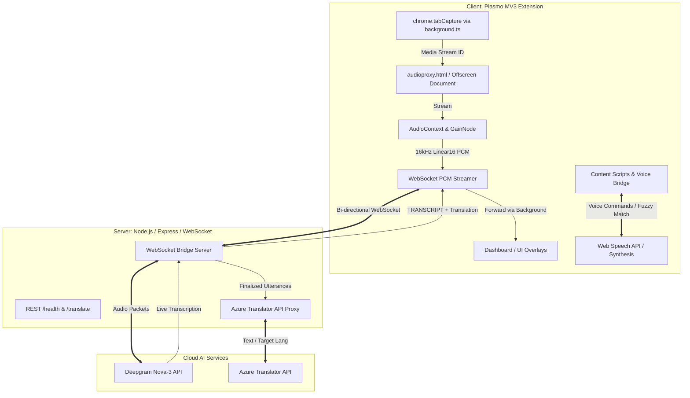

# 🌟 Sensa: Advanced Sensory & Accessibility Assistant

[](https://github.com/bulsu-kdlantolin/sensa-chrome-extension)
[](https://developer.chrome.com/docs/extensions/mv3/)
[](https://docs.plasmo.com/)
[](https://react.js.org/)
[](https://www.typescriptlang.org/)
[](https://tailwindcss.com/)
[](https://deepgram.com/)
[](https://azure.microsoft.com/en-us/products/cognitive-services/translator)

**Sensa** is an architectural-grade, dual-mode Google Chrome browser extension designed to empower deaf, hard-of-hearing, and visually impaired individuals. By bridging cutting-edge Web APIs (Speech Recognition, Speech Synthesis, Web Audio API, Tab Capture) with real-time cloud AI (Deepgram Nova-3 & Azure Translator), Sensa transforms standard web browsing into a fully responsive, tailored sensory experience.

---

## 🎯 Executive Summary & Mission

The modern web is primarily designed for unimpaired audio-visual consumption. Users with sensory disabilities frequently encounter barriers such as uncaptioned audio, lack of multilingual accessibility, cluttered visual layouts, and mouse-dependent navigation. 

**Sensa** solves these challenges through two dedicated, deeply integrated operational modes:
1. **🦻 Auditory Mode (for Deaf & Hard-of-Hearing Users):** Converts tab audio into low-latency, real-time multilingual subtitles with instant translation, visual sound spectrum animations, and environmental noise alerts.
2. **👁️ Visual Mode (for Visually Impaired Users):** Replaces visual-motor navigation with hands-free voice commands, intelligent text-to-speech (TTS) narration, screen magnification, and screen-dimming Focus Mode.

---

## ✨ Core Features & Capabilities

### 🦻 Auditory Mode
* **🎙️ Live Multilingual AI Captions (`useLiveCaptions.ts` & `api.ts`):**
  * Captures browser tab audio via `chrome.tabCapture` and resamples it to 16kHz PCM audio.
  * Streams binary audio packets over WebSockets to Sensa's Node.js backend, which bridges directly into **Deepgram Nova-3**.
  * Supports real-time transcription across **45+ languages** (including English, Spanish, Filipino, Hebrew, Arabic, Japanese, Korean, French, German, and more).
  * Implements a zero-gain `GainNode` audio routing architecture to prevent feedback loops while keeping audio audible to the user.
  * **Auto-Reconnection on Tab Reload:** Seamlessly resumes audio proxying and live caption streaming when host pages reload without requiring manual dock re-activation.
* **🌐 Instant AI Translation (`server.js`):**
  * Integrates **Azure Translator API** server-side to translate finalized speech utterances on-the-fly into the user's target language without exposing API keys to the browser client.
* **📊 60fps Audio Visualizer (`AuditoryDock.tsx` - `SiteAudioSystem`):**
  * Leverages Web Audio API (`AnalyserNode`) to render smooth, framerate-independent frequency bar animations that allow deaf users to "see" audio dynamics and pacing.
* **🚨 Sudden Noise & Loudness Alerts (`AuditoryDock.tsx` & `AuditorySettingsModal.tsx`):**
  * Continuously monitors instantaneous audio energy and triggers non-intrusive visual screen-edge flash overlays whenever sudden audio spikes occur (ratio > 2.0x baseline), alerting users to sharp sounds.
* **🎨 Customizable Subtitle Overlay (`TextSizeOverlay.tsx` & `CaptionTransparencyOverlay.tsx`):**
  * Features draggable styling modals allowing users to scale subtitle typography (12px to 72px) and adjust background opacity (25% to 100%).
  * Draggable viewport offset positioning ensures configuration panels never obscure active video players.
* **📜 Transcript History & Dual-Engine Export (`TranscriptHistoryOverlay.tsx`):**
  * A slide-out sidebar that records chronological dialogue blocks (original source + translation) with smart bottom-lock autoscrolling.
  * **Multi-Format Archive Export:**
    * **Formatted Plain-Text (`.txt`):** Encoded with UTF-8 Byte Order Mark (`\uFEFF`) ensuring international text and symbols render without corruption in all text editors.
    * **High-Resolution Multi-Page PDF (`.pdf`):** Utilizes 2x Device Pixel Ratio HTML5 Canvas rasterization into `jsPDF`, perfectly preserving all international Unicode alphabets (CJK, Cyrillic, Arabic, Hebrew, Filipino, accents, and emoji) without missing glyphs or garbled characters.

---

### 👁️ Visual Mode
* **🗣️ Hands-Free Voice Control (`VisualDock.tsx`, `visualModeVoiceBridge.ts`, `modeSelectionVoiceBridge.ts`):**
  * Injects Web Speech API (`SpeechRecognition`) listeners directly into host pages to enable zero-click navigation.
  * **Comprehensive Voice Commands:**
    * **Navigation:** `"next"`, `"previous"` (and `"prev"`), `"restart"`.
    * **Reading Playback:** `"play"`, `"read"`, `"stop"`, `"pause"`, `"resume"`.
    * **Interface Controls:** `"speed"`, `"settings"`, `"close"` / `"deactivate"`, `"help"` / `"commands"`, `"stop listening"` / `"mute"`.
  * **Utterance Boundary Lock (`ignoreSpeechUntil`):** Implements an active 1500ms speech lock upon executing navigation commands to completely discard trailing interim and final speech slices, guaranteeing that spoken words like "next" or "previous" execute exactly once.
  * **Acoustic Self-Echo Suppression (`ttsEchoFilter.ts`):** Continuously monitors outgoing Speech Synthesis audio to filter out computer-spoken words from the microphone, preventing TTS readouts from looping back into speech commands.
  * **Auditory Mode Microphone Isolation:** The microphone is strictly deactivated while Auditory Mode is active, preventing accidental voice command triggers.
  * **Customizable Wake Word:** Supports the default wake word (`"Sensa"`) as well as user-configured custom wake words stored in `sensa_visual_wake_word`.
  * **Multi-Tab Microphone Guard:** Uses the Page Visibility API to dynamically pause and resume microphone streams as users switch tabs, preventing cross-tab mic contention.
  * **Soft Restart Architecture:** Implements a sub-50ms engine restart strategy to bypass standard network timeouts inherent to the Web Speech API.
* **🧠 Levenshtein Fuzzy Scoring Engine & Homophone Mapping:**
  * Maps common speech misinterpretations (e.g., `"previews"`, `"preview"`, `"review"` -> `"previous"`; `"necks"`, `"nex"` -> `"next"`).
  * Implements dynamic Levenshtein edit distance scaling based on word length to distinguish between commands while preventing antonym false-positives (e.g. `"activate"` vs. `"deactivate"`).
  * Enforces consumed keyword queues (`consumedKeywords`) to strip already-executed command tokens from subsequent interim transcripts.
* **🎙️ Intelligent Voice Selection (`VisualSettingsModal.tsx` & `voiceResolver.ts`):**
  * **Centralized Voice Resolver:** Enforces a single authoritative voice preference across hover announcements, guide dialogues, and article narration.
  * **Mouse Click vs. Voice Separation:** Clicking the voice dropdown opens a visual selector without reading options one-by-one; voice-directed navigation reads choices sequentially and auto-closes upon selection.
  * **Curated Voice Filtering:** Strips redundant "Male" labels and filters out low-quality/broken legacy voices (e.g., Google UK English Female, Google Spanish Female).
  * **Tie-Break Rejection:** Avoids arbitrarily falling back to default voices when speech recognition results are ambiguous.
* **📖 Smart Reader & Advanced AI Extraction (`useSpeech.ts` & `ReadingSpeedOverlay.tsx`):**
  * **4-Layer Content Extraction Pipeline:**
    1. **Mozilla Readability Engine:** Clones the DOM and isolates core article text while stripping ads, navbars, and sidebars.
    2. **Sensa-ID Injection:** Injects tracking tags into live DOM elements before cloning to map text back to screen coordinates for highlight bounding boxes.
    3. **Deep-Pierce Flattener:** Recursively crawls the DOM to penetrate Shadow DOMs and Iframes.
    4. **Semantic AI Fallback (Gemini Nano):** Fallback utilizing Chrome's built-in `window.ai` to semantically summarize heavily obfuscated layouts.
  * Reads extracted text aloud using `window.speechSynthesis` with real-time speed controls (0.5x to 2.5x) and automatic vertical centering.
  * Includes a 1200ms navigation cooldown guard to guarantee smooth sentence traversal.
* **🔍 Interactive Screen Magnifier (`VisualDock.tsx`):**
  * Creates a responsive, high-contrast magnifying lens that enlarges text and DOM elements on hover.
  * **High-Performance Static Engine:** Utilizes an optimized 5fps throttled `MutationObserver` with media element stripping to eliminate lag.
* **🛡️ Zero-Latency Focus Mode (`FocusModeOverlay.tsx`):**
  * A screen-dimming overlay that eliminates visual clutter around active media content.
  * Tracks media elements directly via React refs at 60fps using `requestAnimationFrame`.
* **🎹 Sensory Acoustic Feedback (`useUIHoverAudio.ts` & `VisualWelcomeOverlay.tsx`):**
  * Employs Web Audio API synthesizers (`createOscillator`) to generate acoustic earcons that confirm button hovers and clicks.

---

## 🏗️ System Architecture & Data Pipeline


```mermaid
graph TD
    subgraph Chrome Extension [Client: Plasmo MV3 Extension]
        UI[Dashboard / UI Overlays]
        TC[chrome.tabCapture via background.ts]
        AP[audioproxy.html / Offscreen Document]
        AC[AudioContext & GainNode]
        STT_Client[WebSocket PCM Streamer]
        TTS[Web Speech API / Synthesis]
        DOM[Content Scripts & Voice Bridge]
    end

    subgraph Backend Server [Server: Node.js / Express / WebSocket]
        WSS[WebSocket Bridge Server]
        REST[REST /health & /translate]
        Azure_Proxy[Azure Translator API Proxy]
    end

    subgraph Cloud AI Services
        DG[Deepgram Nova-3 API]
        AZ[Azure Translator API]
    end

    TC -->|Media Stream ID| AP
    AP -->|Stream| AC
    AC -->|16kHz Linear16 PCM| STT_Client
    STT_Client <==>|Bi-directional WebSocket| WSS
    WSS <==>|Audio Packets| DG
    DG -->|Live Transcription| WSS
    WSS -->|Finalized Utterances| Azure_Proxy
    Azure_Proxy <==>|Text / Target Lang| AZ
    WSS -->|TRANSCRIPT + Translation| STT_Client
    STT_Client -->|Forward via Background| UI
    DOM <==>|Voice Commands / Fuzzy Match| TTS
```

### Key Architectural Highlights:
1. **Feedback Loop Prevention:** When capturing browser tab audio for STT, `api.ts` routes audio through a zero-gain `GainNode` before connecting to the destination, ensuring clean audio capture without echoing.
2. **Server-Side API Isolation:** Cloud credentials (`DEEPGRAM_API_KEY`, `AZURE_TRANSLATOR_KEY`, and `AZURE_REGION`) reside strictly within the Node.js backend (`server.js`), protecting sensitive tokens from client-side inspection.
3. **High-Performance DOM Tracking:** In `FocusModeOverlay.tsx`, DOM measurements bypass React state updates inside scroll loops, modifying SVG `<rect>` attributes directly via refs to guarantee 60fps performance without frame drops.

---

## 📁 Project Structure

```text
sensa-chrome-extension/
├── src/
│   ├── background.ts               # Background Service Worker (Tab Capture, CSP Bypasses, Routing)
│   ├── content.tsx                 # Plasmo UI Root (Shadow DOM Injection & Mode Coordination)
│   ├── style.css                   # Tailwind CSS design system & tokens
│   ├── components/                 # UI Overlays & Modal Panels
│   │   ├── AuditoryDock.tsx        # Control dock for Auditory Mode (includes SiteAudioSystem visualizer)
│   │   ├── AuditoryMode.tsx        # Auditory Mode container & lifecycle coordinator
│   │   ├── VisualDock.tsx          # Control dock for Visual Mode (Voice recognition, Magnifier lens)
│   │   ├── VisualMode.tsx          # Visual Mode container & lifecycle coordinator
│   │   ├── LiveCaptionBox.tsx      # Real-time subtitle display box
│   │   ├── FocusModeOverlay.tsx    # SVG mask screen-dimming overlay
│   │   ├── TextSizeOverlay.tsx     # Typography scaling modal (12px-72px)
│   │   ├── CaptionTransparencyOverlay.tsx # Opacity adjustment modal (25%-100%)
│   │   ├── CaptionLanguageOverlay.tsx     # Target translation language selector
│   │   ├── ReadingSpeedOverlay.tsx # TTS rate controller (0.5x-2.5x)
│   │   ├── TranscriptHistoryOverlay.tsx   # Sidebar dialogue log, .txt & .pdf exporter
│   │   ├── AuditoryWelcomeOverlay.tsx     # Auditory onboarding screen
│   │   ├── VisualWelcomeOverlay.tsx       # Visual onboarding screen
│   │   ├── AuditorySettingsModal.tsx      # Config panel for Auditory Mode (Noise alerts, audio)
│   │   ├── VisualSettingsModal.tsx        # Config panel for Visual Mode (Voices, speeds, colors)
│   │   ├── ModeSelection.tsx              # Initial role-selection screen
│   │   ├── ColorPickerPopup.tsx           # Custom visual highlight color tool
│   │   ├── Dashboard.tsx                  # Extension toolbar popup dashboard
│   │   └── Tooltip.tsx                    # Shared UI tooltips
│   ├── contents/                   # Iframe bridging scripts
│   │   ├── iframeAudioRelay.ts     # PostMessage bridge for iframe audio
│   │   └── iframeCaptionOverlay.tsx# Passthrough UI for full-screen iframes
│   ├── hooks/                      # Custom React Hooks
│   │   ├── useLiveCaptions.ts      # Audio capture & WebSocket STT hook
│   │   ├── useSpeech.ts            # Web Speech Synthesis TTS hook & article extractor
│   │   └── useUIHoverAudio.ts      # Acoustic earcon & hover audio synthesizer hook
│   ├── lib/                        # Core Engineering Modules
│   │   ├── api.ts                  # WebSocket bridge & PCM audio streamer
│   │   ├── storage.ts              # Chrome Local Storage schema & persistence
│   │   ├── browserUtils.ts         # Browser & Web Speech API compatibility detection
│   │   ├── audioInterceptorMain.ts # Canvas/Game frequency interceptor
│   │   ├── ttsEchoFilter.ts        # Acoustic self-echo filtering engine for speech synthesis
│   │   ├── voiceResolver.ts        # Authoritative TTS voice resolution & fallback engine
│   │   ├── modeSelectionVoiceBridge.ts    # Onboarding speech listener
│   │   ├── visualModeVoiceBridge.ts       # Visual mode voice command bridge
│   │   └── welcomeVoiceBridge.ts          # Welcome screen voice bridge
│   ├── tabs/                       # Plasmo background tabs/offscreen
│   │   └── audioproxy.tsx          # Offscreen Document (STT PCM Processing & Audio Playback)
│   └── popup.tsx                   # Extension toolbar icon popup entrypoint
├── package.json                    # Extension dependencies, scripts & version manifest
├── tailwind.config.js              # Theme customization & animation rules
└── tsconfig.json                   # Strict TypeScript configuration
```

---

## 🚀 Getting Started & Setup Guide

### Prerequisites
* **Node.js**: Version 18.x or higher
* **Package Manager**: `npm` or `pnpm`
* **Google Chrome**: Version 115+ (for Manifest V3 & Tab Capture support)
* **Backend Server**: Ensure the Sensa Node.js backend (`sensa-backend`) is running locally or deployed to a cloud provider (e.g., Render, Heroku).

---

### 1️⃣ Extension Installation & Development

1. **Navigate to the extension directory:**
   ```bash
   cd sensa-chrome-extension
   ```

2. **Install dependencies:**
   ```bash
   npm install
   # or
   pnpm install
   ```

3. **Start the development bundler:**
   ```bash
   npm run dev
   # or
   pnpm dev
   ```
   *This command compiles TypeScript and React components in real-time and outputs an unpacked bundle to `build/chrome-mv3-dev`.*

4. **Load into Google Chrome:**
   * Open Chrome and navigate to `chrome://extensions/`.
   * Enable **Developer mode** in the top right corner.
   * Click **Load unpacked** and select the `sensa-chrome-extension/build/chrome-mv3-dev` directory.

---

### 2️⃣ Production Build & Web Store ZIP Packaging

To create an optimized, minified production build and generate a Chrome Web Store distribution ZIP:

1. **Build the production bundle:**
   ```bash
   npm run build
   ```

2. **Package the ZIP file:**
   ```bash
   npm run package
   ```

The packaged distribution file will be generated at:
```text
build/chrome-mv3-prod.zip
```
This archive is ready for direct upload to the [Chrome Developer Dashboard](https://chrome.google.com/webstore/devconsole/).

---

## 🧑‍💻 Developer Handover & Standards

This codebase adheres to rigorous software engineering and documentation standards:
* **Architectural JSDoc Headers:** Every core library file (`src/lib/*.ts`) and overlay component (`src/components/*.tsx`) is annotated with comprehensive top-of-file `@file` JSDoc headers explaining module responsibilities, data synchronization, and design decisions.
* **Strict TypeScript Schema:** All state storage, WebSocket payloads, and UI props are strictly typed to prevent runtime errors and ensure seamless IDE IntelliSense.
* **Clean Code Practices:** Informal annotations and debugging comments have been eliminated in favor of professional engineering documentation.

---

## 📄 License & Acknowledgments
* Built by **BSIT 4H-G1 Group 2 — Bulacan State University (BulSU)**.
* Powered by [Plasmo](https://docs.plasmo.com/), [Deepgram](https://deepgram.com/), and [Azure Translator](https://azure.microsoft.com/).
